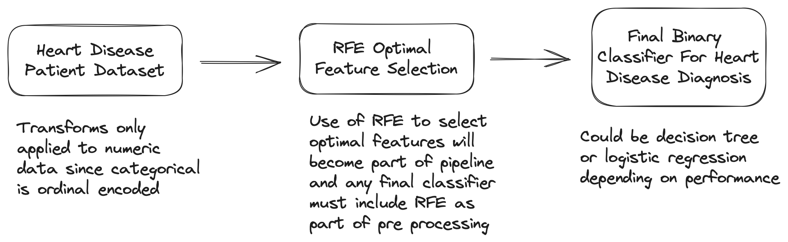
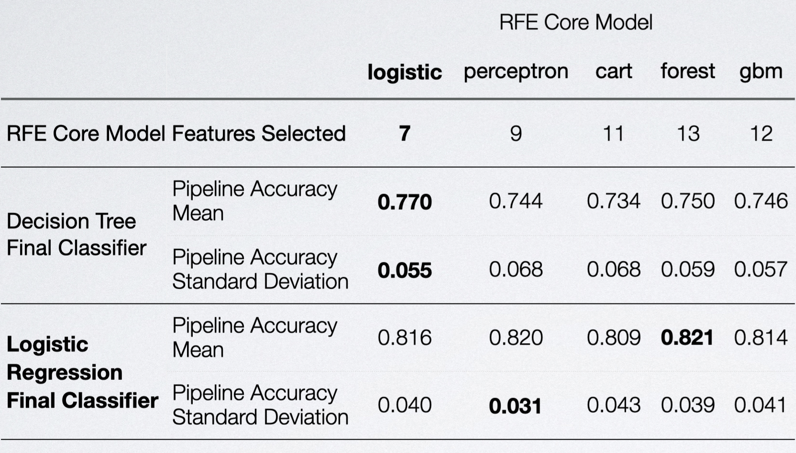
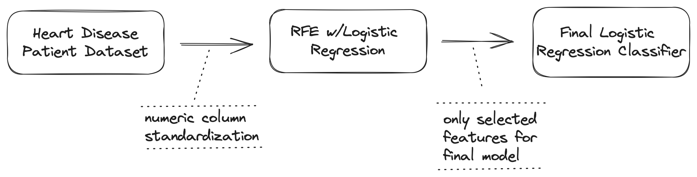

# Pfizer BAI Heart Disease Case Study

This repository contains all the files created and work completed for the
heart disease case study in preparation for an interview for a Pfizer data
science role .

> **Note**
> The code used for the analysis is in the `main.py` file and the static
> artifacts produced by the analysis code are in the `output` directory, and
> the `resources` directory contains any static artifacts used for analysis
> presentation.

## Instructions From Pfizer

***Please put together your answers (slides) and any supporting code or
diagrams/visualizations or however else you feel would be the most appropriate
way to express your answers. Please e-mail this to us.***

### Case Study

We are interested in understanding what are the main contributing factors
toward heart disease?

**Tasks:**

<ol type="a">
 <li>
   Use a predictive model to identify the main contributing factors towards heart disease
 </li>
 <li>
   Put together a mock-up visual to share the results of your analysis. Be prepared to discuss which model(s) you used and why
 </li>
</ol>

### Case Study Data

We have been given a patient-level dataset that measures key demographic and
health outcomes for a given patient.

This dataset has been flagged whether a patient was ultimately diagnosed with
heart disease in the target column. We have also been provided a data dictionary
in the Heart_Disease_Patient_Data_Dictionary tab.

**Dataset**

Data for the case study analysis is sourced from the
`Heart_Disease_Patient_Data` worksheet in the `bai-case-study-heart.xlsx` Excel
workbook and saved to the `heart-disease-patient-data` CSV file in the `data`
directory. In addition to the heart disease patient data, a hidden worksheet
with data tables was also found in the workbook. Those data tables were saved to
individual CSV files in the `data` directory for reference.

**Data Dictionary**

Additionally, below is the data dictionary sourced from the
`Heart_Disease_Patient_Data_Dictionary` worksheet in the previously mentioned
Excel workbook modified with an additional column added to give variable names
an alias that is more human-readable and descriptive.

> **Note**
> From here forward, the variable names will be referred to by their alias

 

| variable	     | alias                     | description                                                    |
|:--------------|:--------------------------|:---------------------------------------------------------------|
| `age`         | `age`                     | age in years                                                   |
| `sex`         | `male_binary`             | (1 = male; 0 = female)                                         |
| `cp`          | `chest pain type`         | chest pain type                                                |
| `trestbps`    | `rest_blood_pressure`     | resting blood pressure (in mm Hg on admission to the hospital) |
| `chol`        | `serum_cholesterol`       | serum cholesterol in mg/dl                                     |
| `fbs`         | `fast_bg_above120_binary` | (fasting blood sugar > 120 mg/dl) (1 = true; 0 = false)        |
| `restecg`     | `rest_ecg_results`        | resting electrocardiographic results                           |
| `thalach`     | `max_heart_rate`          | maximum heart rate achieved                                    |
| `exang`       | `execise_angina_binary`   | exercise induced angina (1 = yes; 0 = no)                      |
| `oldpeak`     | `exercise_st_depression`  | ST depression induced by exercise relative to rest             |
| `slope`       | `exercise_st_slope`       | the slope of the peak exercise ST segment                      |
| `ca`          | `major_vessels_colored`   | number of major vessels (0-3) colored by flourosopy            |
| `thal`        | `thalessemia`             | 3 = normal; 2 = fixed defect; 1 = reversable defect            |
| `target`      | `heart_disease_binary`    | Flag if the patient has heart disease (1) or not (0)           |

> The data heart disease patient dataset appears to be a standard dataset of
> variables used in assessing heart disease. See the [Background Research](#step-2-background-research)
> section below for more information on a paper that uses the same variables to
> classify heart disease.

## Step 1: Exploratory Data Analysis

To see what the data looks like, I ran a Pandas Profiling report on the heart
disease patient data. The HTML full data profile report is saved to
[`/output/patient-data-profile.html`](output/patient-data-profile.html) and can
be easily viewed by opening the file in a web browser.

## Notable Variable Characteristics

* `male_binary` - has a high imbalance toward male sex with 207 observations
  indicated as male and 96 as not-male (female)
* `exercise_st_depression` - has an extreme positive skew with most values being
  `0.0` but with range of `0.0 - 6.2` and a skewness statistic of `~1.27` and
  kurtosis or `~1.57`
* All numeric variables aside from `exercise_st_depression` have a normal
  distribution with and any moderate positive or negative skewness is due to
  one or a few outlier observations

## Step 2: Problem Framing 

### Objectives

**Model Task - Binary Classification**

Identify the contributing factors that are associated with a heart disease
diagnosis.

**Model Selection - Classifier w/Variable Importance**

A binary classification model where the target is the `heart_disease_binary`
variable and all other dataset variables can be assessed as for their importance
in predicting whether a patient diagnosed with heart disease—most decision trees
and regression based models support variable importance.

**Model Interpretation - Variable Importance**

The key assumption to this analysis is that a variable’s contributions to
classification model are separable and can be used to relatively rank their
contribution to the heart disease diagnosis classification

#### Key Considerations

**Model Explainability**

Can we identify the variables that most associated with a heart disease
diagnosis?

**Time Constraint**

The hard cap of 24-48 hours to complete this analysis limits the number of
solution options that can be investigated, and limits the options to more
traditional solutions that are simple to implement in practice.

## Step 3: Contextual Research

### Heart Disease

Developing a heart disease binary classification model necessitates
understanding the medical domain, including heart disease:

* Risk factors
* Symptoms
* Diagnostic criteria
* Clinical data structures

This would involve gathering data from sources like electronic health records,
lifestyle and genetics data, and medical literature, and collaborating with
healthcare professionals for their expert insights.

**Notable literature**

The following paper discusses the creation of a classification system for heart
disease diagnosis and uses variables very similar to our heart disease patient
dataset

* [Heart disA Hybrid Classification System for Heart Disease Diagnosis Based on the RFRS Method](https://www.hindawi.com/journals/cmmm/2017/8272091/)

### Classification Methods

In addition to understanding the heart disease domain, a good heart disease
predictive model requires a deep understanding of classification models
including:

* Model assumptions
* Performance metrics
* Model variety - such as logistic regression, decision trees, or support
  vector machines

It would also be best to know which model types have been most successful in
similar problem domains or contexts, along with an understanding of the ethical
considerations in health-related predictions.

**Notable Literature**

The following paper is helpful in deciding what types of classification
modeling methods to use—dimensionality reduction for classification in this
case.

* [Comparison of PCA and RFE-RF Algorithm in Bankruptcy Prediction](https://dergipark.org.tr/en/download/article-file/2272320#:~:text=The%20most%20important%20difference%20was,features%20into%20a%20lower%20dimension)

## Step 4: Solution Development

> **Note:**
> All solution development code is in the [`/main.py`](main.py) file

### Recursive Feature Elimination

Recursive feature engineering (RFE) is a method used in machine learning where a
model is trained on a dataset, the importance of each feature is determined, and
the least important features are progressively eliminated in subsequent
iterations of model training.

**RFE as A Wrapper Algorithm**

Different machine learning algorithms can be used in the core of the method and
wrapped by the RFE algorithm and used to help select features.

This supports both the evaluation of classification models and feature
importance simultaneously—perfect for our task of building a heart disease
classifier to understand variable contribution.

**RFE Algorithms Assessed For Feature Selection**

* Logistic Regression (logistic)
* Perceptron
* Classification and Regression Tree (cart)
* Random Forest (forest)
* Gradient Boost Machine (gbm)

### Binary Classifier Selection

Decision tree and logistic regression classifiers are good candidates for a
final binary classification model due to their simplicity and explainability

The better model based on the performance and explainability requirements
should be used.  Generally speaking decision trees are explainable more
straightforward to explain, but they often favor variance over bias and could
be lest translatable.

**Full Model Pipeline**  

### Model Pipeline Feature Assessment

**RFE Feature Selection**

Fewer features usually leads to better explainability if accuracy doesn’t
suffer.  In this case, using a logistic regression model as the core model of
the RFE algorithm leads to the fewest features in the final model pipeline.

**Note On Model Tuning**

The default versions of all of these models were used. There may be
considerable room for improvement via iteration and hyperparameter tuning.

## Step 5: Solution Selection & Delivery

### Full Model Pipeline For Heart Disease Classifier

**Pipeline Selection**

Starting from a baseline of the logistic regression as the core for RFE since
it uses the least features, we see that the logistic regression final
classifier also performs better than the decision tree.

Additionally, changing the RFE core model to anything besides logistic
regression does not provide a large lift in model accuracy.  As such, logistic
regression based RFE and final classification is the preferred pipeline

> **Note:**
> Model pipeline accuracy was assessed using 5 fold cross-validation with the
> accuracy mean and standard deviation derived from the combined series of
> scores.

**Selected Full Model Pipeline**

**Final Logistic Classifier Model**

| VARIABLE               | COEFF       |
| ---------------------- | -----------: |
| exercise_st_depression | \-0.7166    |
| male_binary            | \-1.1630    |
| chest_pain_type        | 0.8423      |
| execise_angina_binary  | \-1.0428   |
| exercise_st_slope      | 0.6698      |
| major_vessels_colored  | \-0.7783    |
| thalassemia            | \-0.8149    |
| intercept              | 1.9831      |

